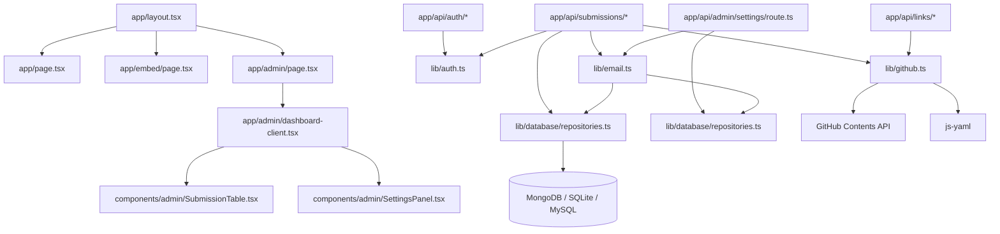
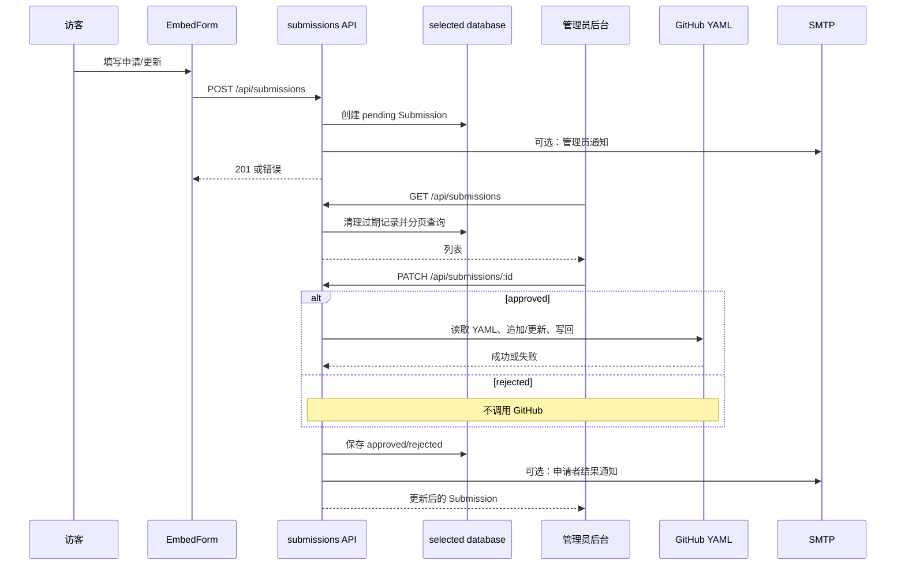
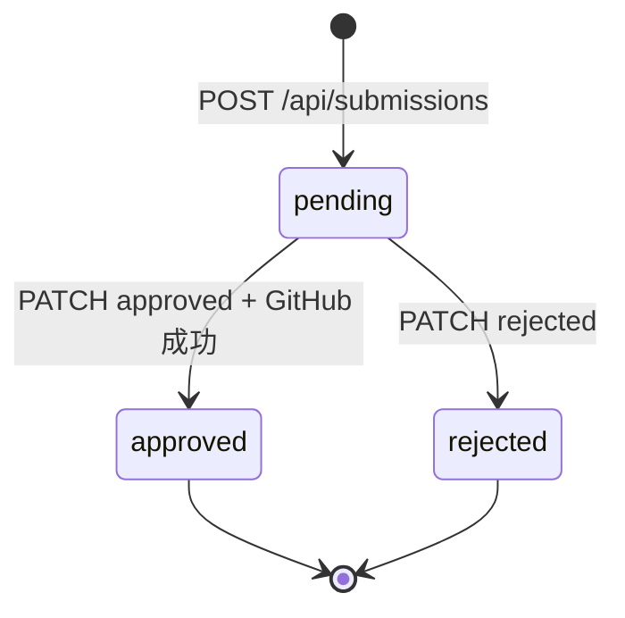

# 整体架构

## 架构判断

本项目是一个**单体式、请求驱动的 Next.js 全栈应用**：页面、客户端组件和 API Route Handlers 位于同一仓库、同一部署单元；数据库 provider（MongoDB、SQLite 或 MySQL）、GitHub 和 SMTP 是由服务端调用的外部边界。

这是一个带有轻量适配器分层的客户端-服务端架构，而不是严格的 Clean Architecture 或微服务架构：

- `app/` 同时承载页面路由和 API HTTP 边界。
- `lib/` 将数据库、认证、邮件和 GitHub 集成抽出，形成可复用服务。
- `lib/database/` 通过 Repository 适配层隔离 MongoDB/Mongoose 与 SQLite/MySQL/Drizzle。
- `lib/models/` 保留 MongoDB 文档结构，作为 Mongo adapter 和迁移源。
- `components/` 承载后台客户端视图和交互状态。
- API 路由直接编排模型与外部适配器，没有单独的 use-case/service 层。

证据：`app/api/submissions/[id]/route.ts:1-6` 直接导入模型、认证、GitHub 和邮件；`app/admin/dashboard-client.tsx:7-8` 组合后台组件。

## 系统上下文

```mermaid
flowchart LR
  Visitor[访客/第三方站点] --> Embed[嵌入表单 /embed 或 /embed.js]
  Embed --> API[Next.js Route Handlers]
  Admin[管理员浏览器] --> AdminPage[/admin]
  AdminPage --> API
  API --> Database[(MongoDB / SQLite / MySQL)]
  API --> GitHub[GitHub Contents API]
  API --> SMTP[SMTP / Nodemailer]
  Deployer[部署者] --> Home[/ 首页 /]
  Home --> Embed
```

图中关系由页面入口、`fetch` 调用和服务端 import 交叉确认：`app/embed/page.tsx:31-69`、`app/admin/dashboard-client.tsx:95-139,237-270,399-404`、`components/admin/LinkGroupManager.tsx:1-321`、`app/api/links/**`、`lib/github.ts:198-241,300-523`、`lib/email.ts:256-291`。

## 组件与分层

| 层 | 组件 | 职责 | 关键边界 |
|---|---|---|---|
| 展示/入口 | `app/page.tsx` | 嵌入代码说明和预览 | 不直接写业务数据 |
| 展示/入口 | `app/embed/page.tsx` | 第三方访客表单 | 通过 JSON POST 进入 API |
| 展示/入口 | `app/admin/*`、`components/admin/*` | 管理员登录和操作 | 通过 session Cookie 调用 API |
| HTTP | `app/api/auth/*` | 登录、注销、当前 session | 与 `lib/auth.ts` 协作 |
| HTTP | `app/api/submissions/*` | 创建、查询、审核、删除 | 与 MongoDB、GitHub、SMTP 编排 |
| HTTP | `app/api/admin/settings/*` | 读写管理配置 | 与 `Config` 模型协作 |
| HTTP | `app/api/links/*` | 读取/编辑 GitHub 分组和已通过友链 | 与 GitHub 适配器协作 |
| 领域/持久化 | `Submission`、`Config` | 申请记录和后台配置 | Repository；Mongo/Mongoose 或 Drizzle SQL |
| 基础设施 | `lib/database/*` | provider 选择、连接和 Repository | `DATABASE_PROVIDER` + provider 专用变量 |
| 兼容层 | `lib/db.ts`、`lib/models/*` | MongoDB 连接和迁移源 | `MONGODB_URI` |
| 适配器 | `lib/github.ts` | Butterfly YAML 到 GitHub Contents API | `GITHUB_*` |
| 适配器 | `lib/email.ts` | 模板渲染到 SMTP | `EMAIL_*`、`SMTP_*` |

## 依赖关系



该图描述静态 import 和关键调用关系；动态框架注册、部署平台路由和远端 YAML 真实结构未进行运行时验证。

## 启动与鉴权组装

1. `app/layout.tsx` 建立 HTML 根布局，注入暗色模式初始化脚本、全局 CSS 和 Toast Provider（`app/layout.tsx:1-27`）。
2. 访问 `/admin` 时，服务端页面调用 `getSession()`；没有有效 session 则 `redirect('/admin/login')`（`app/admin/page.tsx:1-10`）。
3. 登录页 POST `/api/auth/login`；服务端比较 `ADMIN_USERNAME`/`ADMIN_PASSWORD`，调用 `createToken`，将 JWT 写入 HttpOnly `session` Cookie（`app/api/auth/login/route.ts:4-40`）。
4. 管理员 API 再通过 `getSession()` 读取并验证 Cookie（`lib/auth.ts:16-30`）。
5. 登录后的 `AdminDashboard` 并行加载提交列表和 GitHub 状态（`app/admin/dashboard-client.tsx:95-139`）。

## 关键流程：提交与审核



**已确认的顺序**：审核通过时先 GitHub 同步，再保存当前数据库状态，最后尝试结果邮件；见 `app/api/submissions/[id]/route.ts:25-80`。邮件失败被吞掉，不会回滚数据库或 GitHub。

## 页面与嵌入流程

```mermaid
flowchart TD
  Host[外部站点]
  Host -->|iframe src| EmbedPage[/embed]
  Host -->|script src| EmbedScript[/embed.js]
  EmbedScript -->|rewrite| ScriptRoute[app/embed-script/route.ts]
  ScriptRoute -->|动态创建 iframe| EmbedPage
  EmbedPage -->|POST| SubmitAPI[/api/submissions]
  Host -->|自包含 HTML fetch| SubmitAPI
```

- `/embed.js` 由 `next.config.js:2-9` 重写到 `/embed-script`。
- 脚本当前将 Iframe append 到当前 script 的父节点（`app/embed-script/route.ts:8-29`）；README 中“插入 div”的描述与此实现略有差异，见 [references.md](./references.md) 的文档漂移清单。
- `NEXT_PUBLIC_APP_URL` 缺失时脚本会生成相对 `/embed` 路径；跨站部署场景需要人工确认。

## 状态与持久化

`Submission` 的公开状态枚举是 `pending`、`approved`、`rejected`，类型枚举是 `apply`、`update`；数据库内部还使用短期 `processingToken` 防止并发审核（`lib/database/types.ts`、`lib/models/submission.ts:3-47`）。当前审核状态转换由 PATCH 路由控制：



- 已处理提交不能再次 PATCH（`app/api/submissions/[id]/route.ts:31-43`）。
- 拒绝原因没有 schema 字段，也没有保存到数据库；它只在本次结果邮件中使用（`app/api/submissions/[id]/route.ts:70-87`、`lib/models/submission.ts:20-47`）。
- 自动清理依据 `createdAt`，而不是状态变化时间 `updatedAt`（`app/api/submissions/route.ts:70-80`）。

## 重要架构风险与待确认

### 已确认/高可信风险

1. **跨系统无事务或幂等**：GitHub 写入、数据库状态保存、SMTP 通知是多个独立副作用；可能出现 GitHub 已写入但数据库仍 pending，或通知丢失（`app/api/submissions/[id]/route.ts:25-80`）。
2. **认证 fallback**：`lib/auth.ts:4-6` 缺少 `JWT_SECRET` 时使用源码内固定 fallback；生产部署应强制配置强随机密钥。
3. **状态筛选与统计只作用于当前页**：`SubmissionTable` 本地过滤 `submissions`（`components/admin/SubmissionTable.tsx:49-56`），服务端 GET 没有 status 查询参数。
4. **公开查询仍是较大上限而非真正分页**：`public=1` 当前最多读取 10000 条，搜索下沉到各 provider；大数据量仍需进一步限流和分页（`app/api/submissions/route.ts:39-67`）。
5. **输入未统一做运行时 schema、长度、URL/邮箱和 HTML 转义校验**：影响提交数据、邮件模板和 YAML 写入。

### 待确认

- GitHub 写入是否有意直接更新文件，而非创建 PR；当前代码使用 `createOrUpdateFileContents`，没有显式 PR 流程（`lib/github.ts:228-241`）。
- GitHub 目标仓库是否始终满足 `YmlGroup[]` 结构；当前对顶层、分组和友链对象做基本运行时校验，但字段语义仍依赖真实 YAML（`lib/github.ts:160-196`）。
- 指定不存在分组时返回错误、未指定分组时使用/创建“网上邻居”是否符合所有部署者预期（`lib/github.ts:300-323`）。
- 生产环境是否允许未登录访问 `github=1`、`classNames=1`、`screenshotField=1` 辅助查询；这些分支位于认证检查之前（`app/api/submissions/route.ts:29-41`）。
- 管理后台友链编辑会直接提交整个 YAML 文件，仍需用测试仓库核验 SHA 冲突和格式变化。
- Docker CLI 未安装在本次环境，三套 Compose 的真实启动、数据库健康检查和升级流程仍需服务器验收。
