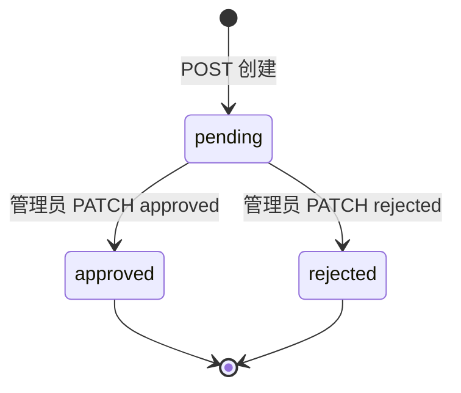
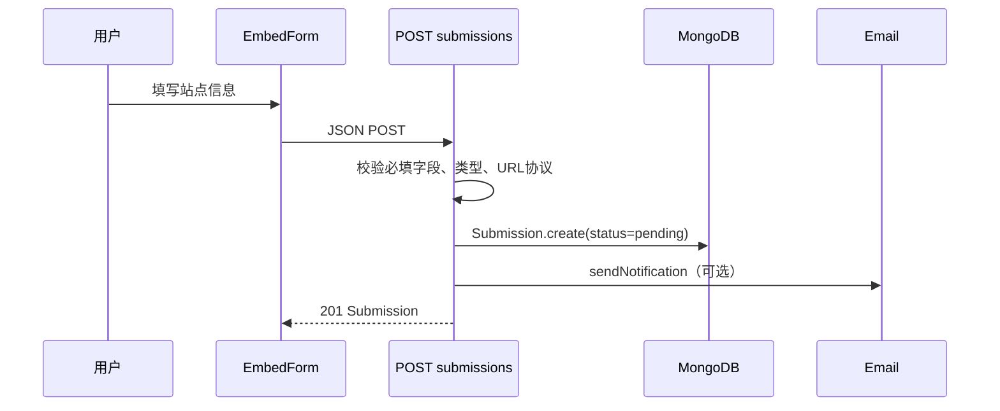
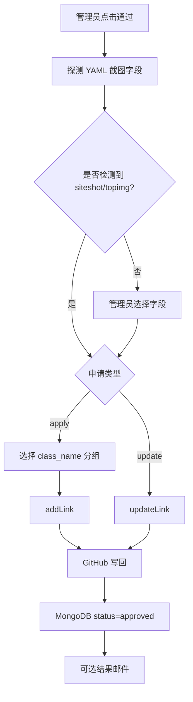

# 数据模型与关键流程

## 核心实体

### `Submission`

定义位置：`lib/models/submission.ts:3-44`。

| 字段 | 类型/默认值 | 含义 | 写入/使用位置 |
|---|---|---|---|
| `name` | String，必填 | 站点名称 | POST、GitHub YAML `name`、邮件 |
| `url` | String，必填 | 新站点地址 | POST；GitHub YAML `link` |
| `description` | String，默认空 | 站点描述 | YAML `descr`、邮件 |
| `avatar` | String，默认空 | 头像 URL | YAML `avatar`、后台预览 |
| `friendslink` | String，默认空 | 申请者友链页 URL | YAML `friendslink`、邮件 |
| `siteshot` | String，默认空 | 截图 URL | 新增/更新时映射到 YAML 截图字段 |
| `topimg` | String，默认空 | 兼容截图 URL 字段 | 允许 API 输入；Embed 会同步为 siteshot 的值 |
| `feeds` | String，默认空 | RSS URL | YAML `feeds`、后台 RSS 链接 |
| `email` | String，默认空 | 结果通知邮箱 | SMTP 结果通知；没有格式 schema 校验 |
| `type` | `apply`/`update` | 新增或更新申请 | PATCH 分流 |
| `originalUrl` | String，默认空 | 更新时定位原 YAML `link` | `updateLink` 精确匹配 |
| `status` | `pending`/`approved`/`rejected` | 审核状态 | 列表、公开查询、清理、状态转换 |
| `createdAt` / `updatedAt` | timestamps | 创建/更新时间 | 自动清理只使用 `createdAt` |

当前 schema 没有 `reason` 字段，因此拒绝理由不持久化（`lib/models/submission.ts:20-44`；`app/api/submissions/[id]/route.ts:83-98`）。

### `Config`

定义位置：`lib/models/config.ts:3-14`。

- `key`：唯一配置键。
- `value`：字符串值；数字设置也以字符串持久化。
- 业务键包括三个清理天数、四个邮件主题、两个邮件 HTML 模板、`owoUrl`（`app/api/admin/settings/route.ts:7-25,33-47,64-97`）。

## 状态机



约束：

- 创建时强制 `pending`（`app/api/submissions/route.ts:148-161`）。
- 只有 pending 可以处理；已处理记录再次 PATCH 会返回 400（`app/api/submissions/[id]/route.ts:31-43`）。
- `approved` 的转换只有在 GitHub 新增/更新成功后才保存状态（`app/api/submissions/[id]/route.ts:46-81`）。
- `rejected` 不调用 GitHub，保存状态后尝试发送结果邮件。

## 新增申请流程



事实：`POST` 至少校验 `name`、`url`、`avatar`、`friendslink`；更新类型额外校验 `originalUrl`；只对主 `url` 检查 `http(s)` 开头（`app/api/submissions/route.ts:115-172`）。

高可信风险：其他 URL、邮箱、长度和 JSON 运行时类型没有统一校验；邮件模板拼接也未统一 HTML 转义（`lib/email.ts:165-239`）。

## 更新申请流程

```text
mode=update 表单
  → body.type=update + originalUrl
  → Submission(type=update, status=pending)
  → 管理员 approved
  → updateLink(originalUrl, entry)
  → 标准化 originalUrl 和 YAML link
  → 在所有分组中精确匹配
  → 重建匹配对象并写回原分组
```

证据：`app/embed/page.tsx:7-13,31-69`、`app/api/submissions/route.ts:129-161`、`lib/github.ts:339-388`。

边界：

- 匹配使用去协议补全、去尾斜杠后的字符串相等。
- 找不到原链接时审核接口返回 502。
- 原分组保持不变。
- 审核更新会保留 YAML 记录中的未建模额外字段和已有 tags；管理员友链管理可清空可选字段，并会删除对应 YAML key。

## 审核通过流程



新增映射：`addLink` 创建 `name/link/avatar/descr`，按有值情况加入截图、RSS、友链页和 tags；未指定分组时使用或创建“网上邻居”，指定不存在的分组会返回错误（`lib/github.ts:300-323`）。

更新映射：`updateLink` 在原分组中替换 name/link/avatar/descr，保留或更新 RSS、友链页、截图和 tags；后台管理还支持跨分组移动（`lib/github.ts:339-388,473-523`）。

一致性边界：GitHub 写回、MongoDB save、邮件发送不是同一事务。GitHub 成功但数据库保存失败时，远程文件可能已更新而提交仍是 pending；邮件失败不会回滚前两者（`app/api/submissions/[id]/route.ts:46-100`）。

## 审核拒绝流程

```text
拒绝 Modal 输入 Markdown reason
  → PATCH {status: rejected, reason}
  → 跳过 GitHub
  → 保存 Submission.status
  → sendResultNotification(reason)
```

拒绝原因只进入本次邮件模板：`lib/email.ts:197-239` 使用有限正则做 Markdown 转 HTML；数据库 schema 中没有该字段。

## 查询与自动清理流程

### 管理员列表

```text
GET /api/submissions?page&p=...&limit=...
  → session 验证
  → MongoDB 连接
  → pending/approved/rejected 分别读取保留天数
  → 按 status + createdAt 删除过期记录
  → sort(createdAt desc) + skip/limit
```

默认保留：pending 7 天、approved 30 天、rejected 30 天（`app/api/submissions/route.ts:9-24,64-101`）。清理触发点是管理员列表 API，不是独立定时任务；基准是 `createdAt`，不是状态变更时间。

### 公开查询

`GET /api/submissions?public=1`：

- 不需要登录。
- 可选 `status` 和名称 `search`。
- 只投影业务字段 `name description friendslink status type feeds`；Mongoose 默认 `_id` 是否序列化保留应以运行时验证为准。
- 没有分页或结果上限，设置 `Access-Control-Allow-Origin: *`。

证据：`app/api/submissions/route.ts:43-61`。

## GitHub YAML 数据流

假定远程文件遵循 Butterfly 结构：

```yaml
- class_name: 友情链接
  class_desc: 我的小伙伴们
  link_list:
    - name: 站点名称
      link: https://example.com
      avatar: https://example.com/avatar.png
      friendslink: https://example.com/link/
      feeds: https://example.com/atom.xml
      siteshot: https://example.com/screenshot.png
      descr: 站点描述
```

此结构来自 `lib/github.ts:15-28` 和 README 示例；远程真实文件未在本次分析中读取，不能保证实际部署一定满足该结构。

数据路径：

1. Octokit 读取文件并 Base64 解码，同时校验分组和友链结构（`lib/github.ts:198-212`）。
2. `yaml.load` 得到 groups。
3. `addLink` push 或 `updateLink` 替换。
4. `yaml.dump` 全量序列化，带原文件 SHA 调用 `createOrUpdateFileContents`（`lib/github.ts:224-241`）。

## 邮件数据流

- 管理员通知：POST 创建记录后调用 `sendNotification`；需要 SMTP 基础配置和 `EMAIL_RECIPIENT`。
- 申请者通知：审核保存状态后调用 `sendResultNotification`；需要申请记录有 email。
- 模板来源：先读 MongoDB `Config`，空值/异常回退默认模板。
- 占位符：在 `lib/email.ts:165-239` 构造；包括 name、url、type、time、原 URL 行、友链页行、RSS 行、结果标题和拒绝原因行。

邮件失败只记录日志，不写入通知状态；这是可观测性和补偿的主要缺口。

## 并发、一致性与错误边界

| 边界 | 当前实现 | 影响 |
|---|---|---|
| 重复申请 | 无 URL/记录去重 | YAML 可能出现重复友链 |
| 并发审核 | 先 find/check pending，再独立 save | 两个请求可能同时执行同步 |
| GitHub 与 DB | 无跨系统事务 | 远程文件和本地状态可能不一致 |
| 邮件 | 同步尝试、失败吞掉 | 通知可能丢失且无重试 |
| YAML 结构 | 对顶层、分组和友链对象做基本运行时校验 | 异常远程文件返回管理/GitHub 错误 |
| 设置 PUT | 逐项 upsert | 中途失败可能部分保存 |
| 清理 | 按 createdAt、列表请求触发 | 长期 pending 的保留语义需确认 |
| 友链管理 | GitHub YAML 为唯一数据源，每次保存读取最新 SHA | 没有 GitHub 写权限时返回 502；不提供单条删除 |
