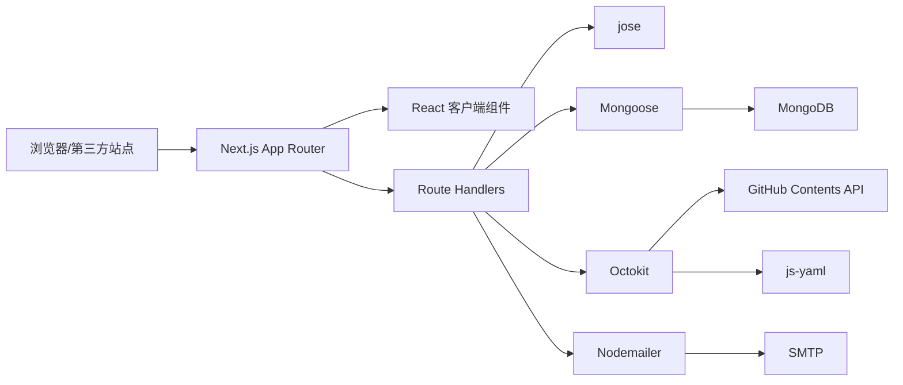

# 依赖与外部系统

## 外部运行时依赖

| 依赖 | 版本来源 | 用途 | 运行时/开发时 | 风险与注意事项 |
|---|---|---|---|---|
| Node.js | README `>=18`；Next 锁文件有更具体 engines | 执行 Next.js | 运行时 | 建议使用满足 Next 15.5.19 engines 的 Node 18.18+ 或 20+ |
| Next.js | `package.json:14`，`^15.5.19` | 页面、App Router、Route Handler、构建 | 运行时/构建 | `next lint` 已有弃用提示，升级时需迁移 lint 命令 |
| React / React DOM | `18.3.1` | 客户端组件与渲染 | 运行时/构建 | 与 Next 版本耦合 |
| TypeScript | `5.9.3` | 类型检查/编译 | 开发/构建 | `tsconfig` 开启 strict，但没有单独 typecheck 脚本 |
| Mongoose | `8.24.0` | MongoDB ODM、模型和查询 | 运行时 | 依赖可用 MongoDB；没有仓库级迁移脚本 |
| jose | `5.10.0` | JWT 创建/验证 | 运行时 | `JWT_SECRET` 缺失会使用固定 fallback |
| octokit | `3.2.2` | GitHub API | 运行时，可选功能 | 审核通过时若未配置会失败；当前直接更新文件 |
| js-yaml | `4.2.0` | 解析/序列化友链 YAML | 运行时 | 远程 YAML 现在有顶层、分组和友链对象的基本运行时校验；全量重写仍可能改变格式 |
| nodemailer | `8.0.10` | SMTP 邮件通知 | 运行时，可选功能 | 错误被捕获；TLS 关闭证书校验 |
| react-hot-toast | `2.6.0` | 后台操作提示 | 客户端 | 由根布局挂载 |
| Tailwind CSS | `3.4.19` | utility CSS | 构建 | `darkMode: 'class'`；样式也依赖 CSS 变量 |
| PostCSS / Autoprefixer | `8.5.15` / `10.5.0` | CSS 构建 | 构建 | `postcss.config.mjs` 注册插件 |
| ESLint / eslint-config-next | `9.39.4` / `15.5.19` | 静态检查 | 开发 | `npm run lint` 当前可执行，但底层 `next lint` 将被淘汰 |

来源：`package.json:5-34`、`tailwind.config.ts:3-13`、`postcss.config.mjs:1-9`、`lib/*.ts`。

## 外部系统边界

### MongoDB

- 连接入口：`lib/db.ts:18-35`。
- 连接字符串来自 `MONGODB_URI`。
- 数据集合由 Mongoose 模型隐式决定：`Submission`、`Config`。
- 所有提交、管理员列表、设置和模板配置依赖 MongoDB。
- 没有事务编排 MongoDB 与 GitHub/SMTP 的跨系统操作。

### GitHub Contents API

- 适配器：`lib/github.ts:198-523`。
- 配置：`GITHUB_TOKEN`、`GITHUB_REPO`、`GITHUB_FILE_PATH`。
- 读取仓库文件，Base64 解码，`yaml.load`，修改 groups，再调用 `createOrUpdateFileContents`。
- 当前没有代码证据表明会创建 Pull Request；`docs.md` 中“提交 PR 或直接推送”比实际实现更宽泛。
- 没有显式 branch、并发重试、重复检查或 YAML schema 验证。

### SMTP

- 适配器：`lib/email.ts:28-295`。
- 配置：`EMAIL_USER`、`EMAIL_PASS`、`EMAIL_NAME`、`EMAIL_RECIPIENT`、`SMTP_SERVER`、`SMTP_PORT`。
- 管理员新提交通知和申请者审核结果通知均为同步请求内尝试。
- 失败只写日志，没有发送状态、重试队列或补偿任务。
- `tls.rejectUnauthorized: false` 是部署安全核验点。

### 外部 OwO JSON

- URL 存在 MongoDB `Config` 的 `owoUrl`。
- 后台拒绝弹窗直接 `fetch(owoUrl)`，并将返回的 `icon` 通过 `dangerouslySetInnerHTML` 渲染（`app/admin/dashboard-client.tsx:141-154,495-498`）。
- 只应配置可信来源；静态分析无法确认实际数据源。

## 内部依赖矩阵

| 调用方 | 被调用模块 | 关系 |
|---|---|---|
| `app/admin/page.tsx` | `lib/auth.ts` | 服务端守卫 |
| `app/api/auth/login` | `lib/auth.ts` | 账号比较、签发 token |
| `app/api/submissions` | `lib/db.ts`、Submission、Config | 写入、查询、清理 |
| `app/api/submissions` | `lib/github.ts` | 查询状态、分组、截图字段；部分接口未先鉴权 |
| `app/api/submissions` | `lib/email.ts` | 新提交管理员通知 |
| `app/api/submissions/[id]` | `lib/github.ts` | 审核通过时新增/更新 YAML |
| `app/api/submissions/[id]` | `lib/email.ts` | 审核结果通知 |
| `app/api/admin/settings` | Config、`lib/email.ts` | 配置持久化、默认模板、SMTP 状态 |
| `AdminDashboard` | submissions API | 列表、辅助查询、审核、删除、注销 |
| `SettingsPanel` | settings API | 加载和保存配置 |

## 依赖图

## 循环依赖与结构观察

- 未从静态 import 扫描发现明确的模块循环依赖。
- `lib/email.ts` 依赖 `lib/db.ts` 和 `Config` 读取模板；设置 API 又依赖 `lib/email.ts` 读取默认模板和 SMTP 状态，形成业务层面的双向协作，但不是静态 import 循环：`app/api/admin/settings/route.ts:2-5`、`lib/email.ts:2-3`。
- API 路由同时承担认证、数据校验、业务编排和错误映射；新增测试或异步补偿机制时，建议先抽出 use-case/service seam。
- 全量重写 YAML、直接 SMTP 和同步审核请求是当前最强外部耦合点。

## 升级/维护注意事项

1. 升级 Next.js 时同时检查 `next lint` 迁移和 App Router Route Handler `params` 类型。
2. 升级 Mongoose 时验证开发热重载下 global cache 行为和 schema model 重用。
3. 升级 `jose` 或修改 JWT 时必须保持 Cookie 属性、过期策略和密钥强制配置一致。
4. 升级 `js-yaml` 或改变 YAML 格式前，先用真实目标仓库样本验证注释、字段顺序和特殊 YAML 结构。
5. 修改邮件模板或用户输入路径时，优先补 HTML escape/sanitization 测试，不能只依赖邮件客户端清洗。
6. GitHub 写入若改成 PR/队列，应同步调整审核状态模型，避免当前“远程写成功后才置 approved”的假设失效。
